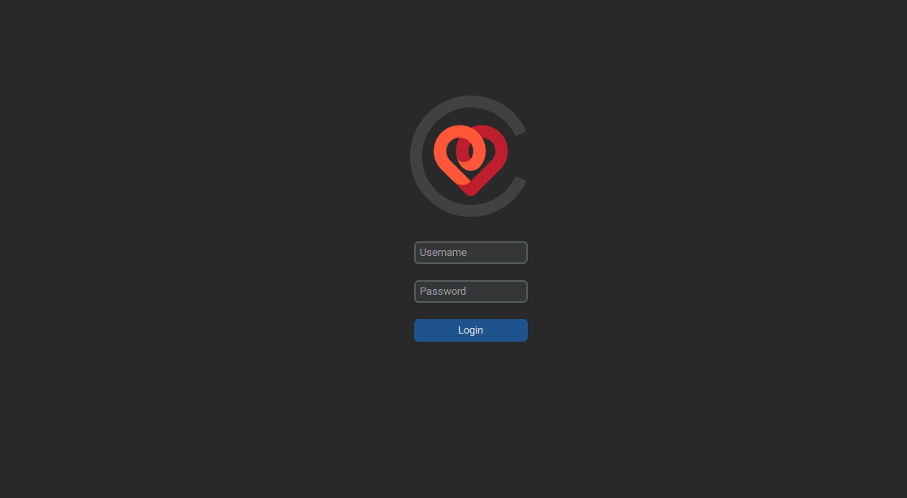
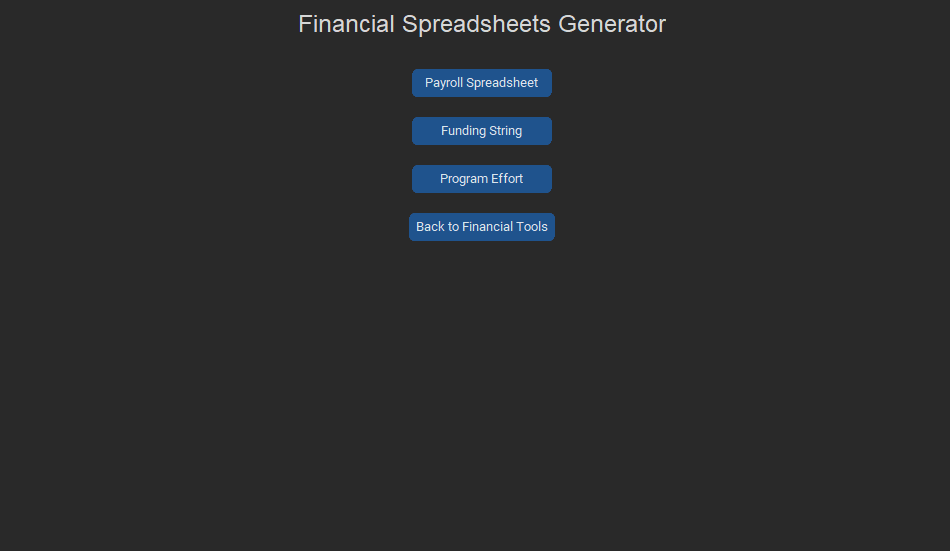
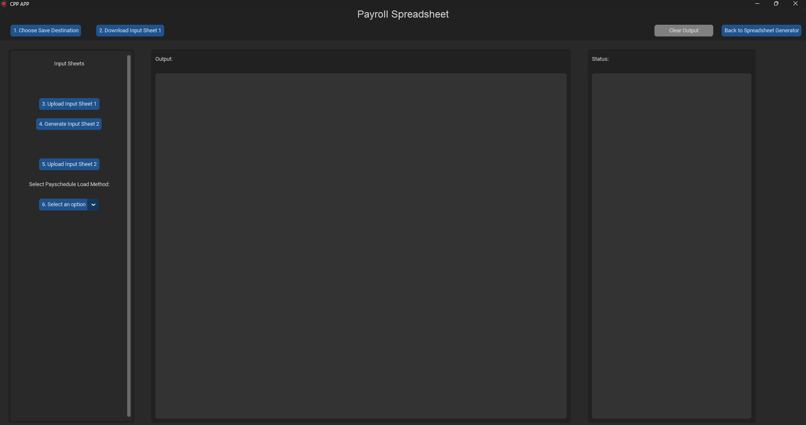

# The CPP App  
**Automated Payroll and Admin Utility Tool**

This is a custom desktop application built to dramatically improve the efficiency of payroll processing tasks at the Center for Patient Partnerships (CPP). Developed over a few months during my tenure as an Admin and IT Assistant, this tool automates approximately 80% of the payroll document workflow, saving valuable time and reducing the risk of human error.

---

## Overview

This application streamlines the generation of payroll spreadsheets, manages funding strings, and produces custom reports—all via an intuitive GUI. It's designed for internal administrative use, especially for organizations that rely heavily on Excel-based processes.

---

## Features

- Login Authentication – Simple login screen to control access.
- Centralized Menu Dashboard – Easily navigate between utilities.
- Automated Payroll Generator – Quickly generate customized payroll spreadsheets.
- Funding String Management – Automate common input fields to ensure consistency.
- Custom Report Builder – Create tailored reports for finance and admin tasks.
- Excel Integration – Built using Openpyxl to interact directly with `.xlsx` files.

---

## Screenshots

**Note:** Output documents are not shared due to privacy and confidentiality reasons.

### Login Page

### Main Menu  
Access all utilities from a central hub.  

### Payroll Dashboard  
Streamline payroll creation and manage funding strings.  

---

## Tech Stack

- Language: Python  
- GUI Framework: Tkinter  
- Excel Handling: Openpyxl  

---

## Getting Started

This application was developed for internal use at the Center for Patient Partnerships and is not intended for public distribution or deployment. As such, setup and execution instructions are not provided, and the codebase may rely on internal files, workflows, or data structures that are not publicly available.

If you are viewing this repository for reference or learning purposes, please note that certain functionality may not work outside its original environment.

---

## Project Status

**Completed (internally deployed)**

Planned improvements may include:

- Secure credential management
- Export templates for different departments
- Enhanced input validation

---

## About

This project was developed as part of my work at the Center for Patient Partnerships. It reflects my interest in building practical, real-world tools that combine automation with usability.

If you would like a demo, feel free to contact me.
